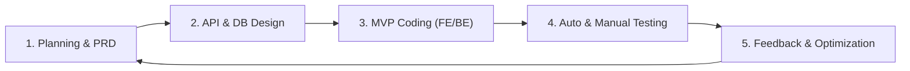
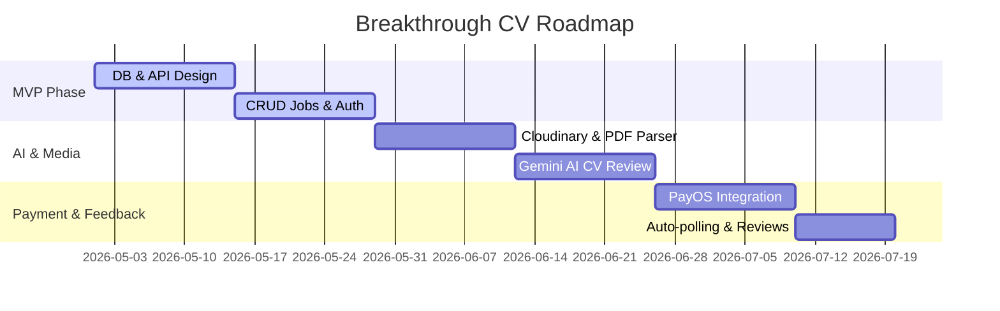
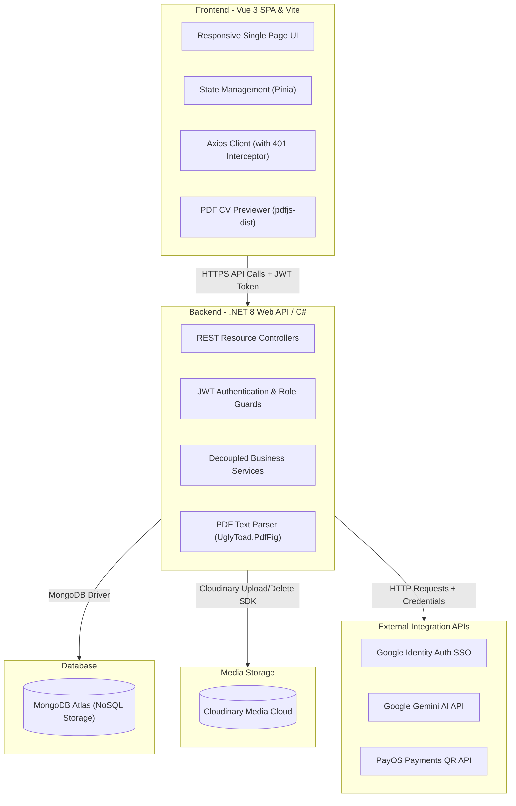

# FINAL PROGRESS REPORT - BREAKTHROUGH CV PROJECT
## SECTIONS ASSIGNED TO: @Thien (1.1, 1.2, 1.3, 2.1)

---

## Section 1. Activities and Achievements This Semester

### 1.1 Semester Overview - TTT

#### * Project vision and objectives
* **Project Vision:** *Breakthrough CV* is positioned as a leading AI-powered resume optimization and smart job matching platform in Vietnam. The platform harnesses the power of Generative AI to bridge the gap between job seekers and employers. It helps candidates maximize their chances of passing Applicant Tracking Systems (ATS) filters and enables recruiters to find the most suitable talent with optimized time and cost.
* **Strategic Objectives:**
  1. **Accelerate Candidate Interview Rates:** Build an automated resume analysis tool that reviews CVs against Job Descriptions (JDs), scores compatibility, highlights missing keyword skills, and provides tailored, ATS-friendly rewrite suggestions.
  2. **Optimize Recruiter Workflows:** Provide a fast job-posting solution backed by AI (automatically recommending responsibilities, must-have, and nice-to-have skills) and an intuitive, real-time candidate application tracker.
  3. **Establish a Viable Business Model:** Integrate a local payment gateway (PayOS) to commercialize premium features via flexible billing cycles (Weekly, Monthly, Yearly).

#### * Development timeline
The project spanned a 16-week development lifecycle, divided into 4 key phases:
* **Weeks 1 - 4: Market Research and Requirements Definition (Planning & PRD)**
  * Conducted market research and gathered feedback on candidate and recruiter pain points.
  * Finalized the Product Requirements Document (PRD).
  * Designed user flows and the overall system architecture.
* **Weeks 5 - 6: System Design and Architecture Setup (Architecture & API Design)**
  * Selected the tech stack (.NET 8 Web API, MongoDB, Vue 3, Pinia, Tailwind CSS).
  * Designed the MongoDB database schemas and defined the core REST API boundaries.
  * Crafted high-fidelity UI mockups for all key screens.
* **Weeks 7 - 12: MVP Development (Core Development)**
  * **Sprint 1 (Weeks 7-8):** Completed secure Google OAuth2 login and role provisioning. Built the Job Management (CRUD Jobs) and Company Profile Management systems.
  * **Sprint 2 (Weeks 9-10):** Integrated Cloudinary storage for CV uploads and developed a backend text extraction service using `UglyToad.PdfPig`. Integrated Google Gemini AI to analyze resumes against JDs and suggest matching jobs.
  * **Sprint 3 (Weeks 11-12):** Integrated the PayOS payment gateway with a secure HMAC-signed Webhook handler. Developed the Transaction History panel and AI plan purchase system.
* **Weeks 13 - 16: Testing, Optimization, and Release (Validation & Launch)**
  * Conducted automated API smoke tests (via a PowerShell script) and manual QA.
  * Resolved critical issues (race conditions, Vue 3 UI state bugs, and cascade deletion resource leaks on candidate application cancellation).
  * Gathered user feedback via the built-in Website Review module, compiled reports, and prepared the platform for soft launch.

#### * Overall workflow from planning to validation
The team followed a streamlined Agile/Scrum process:

1. **Planning:** The PRD defined the boundaries of the MVP, successfully preventing scope creep.
2. **Design:** Clearly defined API contracts allowed Frontend and Backend developers to work in parallel.
3. **Coding:** Tasks were tracked via Git issues and pull requests underwent code reviews before merging.
4. **Testing:** Automated PowerShell smoke tests checked core endpoints to quickly identify integration bugs.
5. **Validation:** Released to a focus group for internal feedback and collected ratings directly through the Website Review feature.

---

### 1.2 Product Roadmap - TTT

#### 1.2.1 Problem Identification
* **Target Users:**
  * **Candidates:** Fresh graduates, junior, and mid-level software developers who need to optimize their resumes for ATS screening and tailor them for different jobs.
  * **Recruiters:** HR specialists, hiring managers, and tech leads at small-to-medium IT companies seeking qualified talent without high agency fees.
* **User Pain Points:**
  * *For Candidates:*
    1. Submitting dozens of applications and getting ignored because their CVs lack the relevant keywords to pass automated ATS filters.
    2. Missing actionable feedback on why their resume is failing to match job requirements.
    3. Customizing a CV manually for multiple different job descriptions is tedious and time-consuming.
  * *For Recruiters:*
    1. Receiving high volumes of generic, uncustomized resumes that do not match the job description, requiring extensive manual filtering.
    2. Drafting JDs is time-consuming, particularly when listing exact must-have and nice-to-have technical skills.
* **Market Opportunity:**
  * The rise of generative AI offers a scalable way to provide instant, personalized resume rewriting services at a fraction of the cost of traditional career coaching.
  * The Vietnamese IT recruitment market is recovering, and quick QR-based payment gateways (PayOS) make it easy to monetize AI services directly from users.

#### 1.2.2 Solution Design
* **Value Proposition:**
  * *"Tailor your CV to any Job Description in 30 seconds - Land 3x more interviews."*
  * Deliver an end-to-end platform that provides ATS scoring, keyword mapping, and side-by-side rewriting suggestions customized for actual job postings.
* **Core Features:**
  1. **One-Tap Authentication (Google Auth):** Secure Google SSO with immediate, post-login role selection (`candidate` or `recruiter`).
  2. **Smart CV Management:** Upload and store resumes securely on Cloudinary. View PDFs directly inside the browser using an integrated viewer.
  3. **AI CV Optimizer (Gemini AI):** Match CVs against JDs to receive: an ATS compatibility score (0-100), a list of missing keywords, critical fixes, and side-by-side original-to-rewrite suggestions.
  4. **AI Job Suggestion:** Automatically analyze an uploaded CV to match and recommend the top 3 jobs available on the platform, along with reasoning.
  5. **Recruitment Portal:** Let recruiters manage job listings, use AI to draft JDs (suggesting technical skills and responsibilities), preview applicant CVs inline, and update hiring statuses.
  6. **PayOS Billing Integration:** Purchase flexible AI packages (Weekly, Monthly, Yearly) via automated QR-code scanning with instant webhook fulfillment.
* **Competitive Differentiation:**
  * **AI Job Copilot:** Supports recruiters in writing better job ads (Must-have/Nice-to-have/Responsibilities) rather than just helping candidates optimize CVs.
  * **JD-Driven Scoring:** Scores resumes based on direct compatibility with specific job postings rather than offering generic feedback.
  * **Local QR Payment Gateway:** PayOS integration provides a friction-free payment experience via local bank apps, eliminating the need for international credit cards.

#### 1.2.3 Product Planning
* **Product Roadmap:**

* **Milestones:**
  * **Milestone 1 - Core MVP:** Basic registration, role assignment, job posting, and candidate search functionality.
  * **Milestone 2 - AI Integration:** Complete Gemini AI integration for resume reviews, job matching, and recruiter JD assistance.
  * **Milestone 3 - Commercialization & UX Polish:** Enable PayOS payments, transaction logs, cascade database deletes for cancelled applications, and real-time UI synchronization.
* **Team Responsibilities:**
  * **Nguyen Tien Thanh (TTT - Project Manager & PO):** Managed project timelines, structured business processes, designed user flows, and created product roadmaps.
  * **Tran Duc Thien (Thien - Full Stack Developer):** Built core Frontend views, integrated Gemini AI services, implemented backend PDF text extraction services, and developed core REST APIs.
  * **Le Quang Anh (Full Stack Developer):** Managed MongoDB schemas, designed database indices, integrated the PayOS payment gateway, and established secure webhook verification.
  * **Tran Nhat Minh (GTM & Marketing):** Conducted market research, defined target audiences, and drove user acquisition strategies.
  * **Hoang Lam (Soft Launch & Deployment):** Handled server deployment, organized the soft launch, and compiled marketing assets (Facebook campaigns).
  * **Nguyen Thi Huyen Trang (Customer Feedback & Analytics):** Conducted customer surveys, gathered reviews, and measured user satisfaction metrics.

---

### 1.3 MVP Development @Thiện & @Lê Quang Anh

#### 1.3.1 MVP Objectives
The MVP version aimed to achieve the following technical and business goals:
* Ensure secure Google login with precise role delegation and JWT session handling.
* Parse PDF files on the backend to extract plain text for AI processing without bloating API request payloads.
* Integrate Google Gemini AI to analyze CVs and match jobs, keeping response times under 5 seconds.
* Automate the purchase of AI access rights through the PayOS gateway and handle transaction fulfillment asynchronously using Webhooks.

#### 1.3.2 Product Architecture
The system employs a standard three-tier architecture, mapped below:



#### 1.3.3 Core Completed Functionalities
1. **Google Authentication & Role Authorization:** Secure authentication using Google Identity. The system checks if a new user has set a role, displays the `select-role` page if missing, and issues a refreshed JWT containing claims matching their role (`candidate` or `recruiter`).
2. **Company & Job Management:**
   * Recruiters have full CRUD capabilities over company details and job postings.
   * *AI Job Copilot:* Recruiters can trigger Gemini AI to auto-populate Must-have skills, Nice-to-have skills, and Responsibilities based on the job title and category.
3. **CV Upload & Extracting Engine:**
   * Candidates upload their resumes in PDF format. Files are sent to the backend, validated, and uploaded to Cloudinary.
   * The backend's `PdfTextService` uses `UglyToad.PdfPig` to extract raw text from the PDF. The text is cached in the MongoDB document, ensuring the frontend never needs to send large raw text payloads during AI operations.
4. **AI CV Review & Scoring (Gemini Integration):**
   * Candidates choose a job and request an AI Review.
   * `GeminiService` passes the resume text and the JD to the `gemini-3.1-flash-lite` model, enforcing a structured JSON response (`responseMimeType: "application/json"`).
   * The response returns an ATS compatibility score, a list of missing keywords, critical fixes, and side-by-side original-to-suggested text rewrites.
5. **Real-time Application Tracking & Cascade Clean:**
   * Recruiters can view applicant lists for their posted jobs. The dashboard displays applicant details, inline PDF CV previews, and buttons to transition application states (Pending → Reviewed → Accepted or Rejected).
   * Data Synchronization: The applicant list automatically polls every 30 seconds to capture candidates submitting or cancelling applications.
   * Cascade Deletions: When a candidate cancels an application, the backend deletes the `Application` document, triggers a cascade delete on all associated `CvReviews` in MongoDB, and initiates a best-effort delete on Cloudinary to remove the CV file.
6. **PayOS Billing Integration:**
   * Implemented pricing plans: Weekly (10,000 VND), Monthly (30,000 VND), and Yearly (150,000 VND).
   * Creates a payment link via PayOS. When a user pays, PayOS sends an asynchronous webhook (secured using an HMAC-SHA256 checksum) to transition the transaction state to `PAID` and extend the user's `AiAccessExpiresAt` date.

#### 1.3.4 Prototype Development
The prototype was built on a uniform layouts system (`AppLayout.vue`). The design features a premium visual aesthetic:
* A modern color scheme (Indigo, Emerald, and Rose against a Slate background).
* High-radius rounded cards, subtle shadows, and interactive hover transitions.
* Color-coded status badges for recruitment phases (yellow=Pending, blue=Reviewed, green=Accepted, red=Rejected) and payments.
* Side-by-side panels for applicant management, displaying candidate details directly next to their resume previews.

#### 1.3.5 Internal Testing
The QA process included:
* **Automated Smoke Testing:** A PowerShell test script (`./scripts/feature-smoke-test.ps1`) simulated client requests to verify 15 core API scenarios, including Google login, role restrictions (blocking candidates from recruiter endpoints with a `403 Forbidden` response), categoryId normalization (ensuring empty category fields are saved as `null` rather than causing a 500 error), and AI job recommendations. All test cases passed successfully.
* **Manual Verification:** Simulated registration, job postings, CV uploads, sandbox payments via PayOS, network failure handling, and real-time polling updates when applications were cancelled.

#### 1.3.6 MVP Outcomes
* The system is stable on local and staging environments, building successfully on both the frontend (Vite production build) and the backend (.NET 8).
* All application data is stored and retrieved correctly using MongoDB Atlas.
* The Gemini AI model successfully generates resume feedback inside the enforced JSON schemas.
* The automated QR billing loop functions end-to-end.

---

## Section 2. Lessons Learned

### 2.1 MVP Development @Thiện & @Lê Quang Anh

#### * Challenges
During MVP development, the technical team (@Thien & @Le Quang Anh) encountered five major obstacles:
1. **Unreliable Client-Side PDF Parsing:** Extracting text from PDF resumes on the frontend proved slow, failed on complex document layouts, and bloated API request payloads due to transferring raw text.
2. **Outdated Application Data in Recruiter Panel:** The recruiter application list did not load automatically on mount and required a manual click. Furthermore, if a candidate cancelled an application, the recruiter's screen remained outdated, creating a data sync gap.
3. **Database Integrity and Orphaned Documents:** When candidates cancelled an application, database records like `CvReviews` were left orphaned in MongoDB (which does not enforce foreign keys or cascade deletes out of the box).
4. **Backend Server Crashes on Empty Category IDs:** If a recruiter submitted a job or company without choosing a category, the empty string caused the MongoDB driver to throw an ObjectId parsing exception, resulting in a `500 Internal Server Error`.
5. **Webhook Authentication and Security:** The system needed to verify that incoming webhook payment updates were authentic requests sent by PayOS rather than forged payloads.

#### * Solutions Implemented
We resolved these issues with the following solutions:
* **Backend PDF Parsing:** Moved text extraction logic to the backend `PdfTextService` using `UglyToad.PdfPig`. Candidates upload the PDF file once. The backend parses and saves the raw text in the database, reducing API overhead.
* **Reactive UI and Auto-Polling:** Refactored `ApplicationManagement.vue`:
  * Implemented a Vue 3 `watch` on `selectedJobId` to automatically load applicants as soon as the recruiter switches job filters.
  * Added a 30-second auto-polling cycle to sync candidate cancellations in the background, accompanied by a manual refresh button showing a last-updated timestamp.
* **Application-Level Cascade Deletion:** Programmed cascade deletes into the backend controllers. When an application is deleted, the server deletes the main `Application` document, queries and deletes all corresponding `CvReviews` matching the `applicationId`, and issues a delete command to Cloudinary to clean up the source PDF.
  
  ```mermaid
  sequenceDiagram
      autonumber
      actor Candidate
      participant BE as Backend Web API
      participant DB as MongoDB Atlas
      participant Cloud as Cloudinary
      
      Candidate->>BE: DELETE /api/applications/{id}
      Note over BE: Validate Ownership & Auth
      BE->>DB: Delete Application Document
      BE->>DB: Cascade Delete related CvReviews (by applicationId)
      BE->>Cloud: Request source CV file deletion
      BE-->>Candidate: Return 204 No Content
  ```

* **Input Normalization and Validation:** Added a validation helper to handle optional ObjectIds:
  ```csharp
  private static bool TryNormalizeOptionalObjectId(string? value, out string? normalized)
  {
      if (string.IsNullOrWhiteSpace(value))
      {
          normalized = null;
          return true; // Accept empty strings and normalize to null for MongoDB
      }
      if (!ObjectId.TryParse(value, out _))
      {
          normalized = null;
          return false; // Return a clean 400 Bad Request if formatting is invalid
      }
      normalized = value;
      return true;
  }
  ```
* **HMAC Signature Webhook Verification:** Implemented HMAC-SHA256 signature checking in `PaymentsController.cs`. When the server receives a webhook payload, it uses the PayOS `ChecksumKey` stored in environmental variables to calculate the payload signature and compares it with the request signature. The transaction updates to `PAID` only if they match.

  ```mermaid
  flowchart TD
      PayOS["PayOS Server"] -->|"POST Webhook (Body + Signature)"| API["PaymentsController Webhook Endpoint"]
      API --> GetKey["Retrieve ChecksumKey from Environment Variables"]
      GetKey --> Hash["Compute HMAC-SHA256 of Payload Body"]
      Hash --> Compare{"Calculated Signature == PayOS Signature?"}
      Compare -->|"No"| Fail["Return 400 Bad Request (Reject Update)"]
      Compare -->|"Yes"| DB["Update Transaction status to PAID & Extend User AI Access"]
      DB --> Success["Return 200 OK with { received: true }"]
  ```

#### * Lessons Learned
1. **Decoupled Architecture Simplifies Integrations:** Separating concerns into dedicated Services (Gemini, PayOS, Cloudinary) makes adding third-party APIs straightforward and prevents changes from breaking other features.
2. **Sanitize and Validate All Client Inputs:** Never trust client-side data. Sanitizing fields (like optional category IDs) is critical to prevent unhandled database driver errors and maintain server uptime.
3. **Reactive UI is Key to User Experience:** Relying on manual actions for data synchronization results in a frustrating UX. Automated reactive watches and background polling are essential for business-facing dashboards.
4. **NoSQL Databases Require Application-Level Handlers:** Since NoSQL databases lack relational constraints, developers must program cascade cleanups manually to prevent database bloat and orphan records.

---
